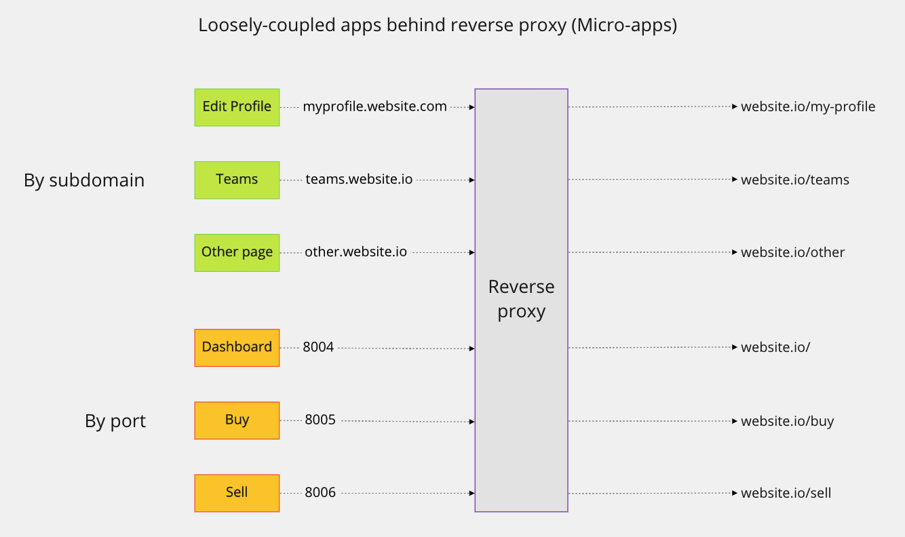
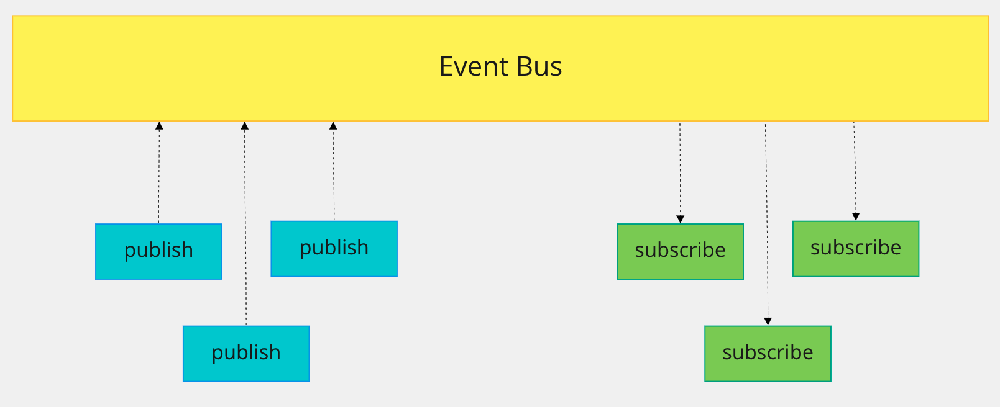

<!-- markdownlint-disable-next-line no-inline-html -->
<h1 id="micro-apps">Micro-apps</h1>

**Micro-apps are small but complete front-end applications that follow the single-responsibility principle: do *one* thing and do it well.** Ddui is a micro-app.

By breaking a large monolithic front-end application into many small micro-apps, many benefits accrue:

1. The individual micro-apps are small enough to fit in single dev's brain
2. Each app "owned" by one dev (with one buddy for backup)
   1. Ownership model avoids tragedy of the unregulated commons
3. Apps are essentially black boxes
   1. Formal contract specifies API (messages accepted/sent)
   2. Essentially, follows the actor model/pub-sub
   3. Use Event Bus for communication between components, tabs, devices, micro-apps
      1. BroadcastChannel
      2. Websockets, or
      3. Server-sent events
4. Devs can experiment with other frameworks/libraries/paradigms
   1. Safe way to test new frameworks/libraries
   2. Keeps devs up-to-date
   3. Keeps devs interested and excited
5. All code in micro-app is specific to a single developer, thus consistent (we hope)
6. Can show experiments to other devs (e.g., in guilds)
   1. Easy to identify misconceptions, etc.
   2. Everyone benefits from individual experiments
7. Reduced tech debt
   1. Apps can be updated, upgraded, refactored quickly
8. Security
   1. Break into one app, not in others
   2. Smaller apps easier to test, think about
   3. Buddy system keeps backup for IP
   4. Easier to document and keep documentation up to date
      1. Sole responsibility of app owner
      2. Everyone can see if you're doing your job or not
9. Robustness
   1. If an app breaks, we only lose that page/section of page
   2. Reverse proxy can also load balance across copies of same app
10. Granularity and scalability
    1. Can run as many copies of each app as necessary to handle the load
    2. Can scale up only necessary pages (e.g., AWS)
    3. Can cache/lazy load at a very granular level
11. To hell with CORS
    1. Reverse proxy makes everything come from the same URL
    2. Heh, heh. Nice.

There are of course a few things that **must be done well** for micro-apps to work:

1. Must carefully optimize to prevent too much duplicate download
   1. Move CSS to centralized CDN where possible and practicable
   2. Lazy load when possible
   3. Static or SSR as much as possible
   4. Site should work (as much as possible) without JS
   5. Keep browser-side JS simple! Make every line count
   6. Concurrency!
   7. Optimize the hell out of everything
2. A well-architected, top-down plan for the site is essential
   1. ONE key individual should be responsible for:
      1. Determining the bounded context: what is an app, what isn't
      2. Determining the formal contracts for each app (API)
      3. Setting standards for performance, accessibility, UX, etc.
   2. Provide a clear, comprehensive design system
      1. HTML for components (final output of each app)
         1. This is what the code should generate (react/svelte/etc.)
      2. Associated CSS provided to match HTML output
      3. No deviation without approval
3. Testing requires careful division of duties
   1. Owner of app responsible for:
      1. Static testing (TypeScript)
      2. Unit testing (but only where necessary)
      3. Integration testing (preferred)
      4. Mock only at boundaries of app
      5. End-to-end tests of self-contained app
   2. Testers responsible for:
      1. Testing coordination of full app (via reverse proxy) (e2e)

**Here is what a set of micro-apps behind a reverse proxy (by subdomain or port) looks like:**

[top](#top)

<!-- markdownlint-disable-next-line no-inline-html -->
<h3 id="loose-coupling">Loose coupling between and within micro-apps</h3>

#### In the browser

* CustomEvent
  * Between components on same page
* Window BroadcastChannel
  * Between tabs/windows

#### Between devices or micro-apps

* Web sockets or server-sent events
  * Between devices (laptop, tablet, phone)
* Polling
  * Can be used as a fallback

It's a very simple model:

[top](#top)
