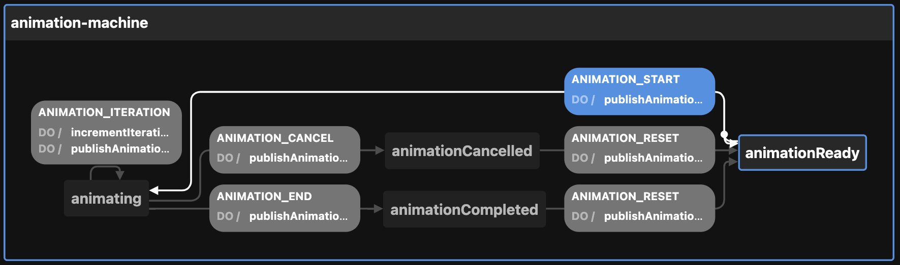

# Creating the Animation state machine

View the [Visualization](https://stately.ai/viz/5b86b789-a70c-4e05-a664-46881853a1f2). See the `index.test.tsx` file for examples of use.

Calling `createAnimationMachineConfig` thus:

```ts
createAnimationMachineConfig({
  enabledEvents: [
    "ANIMATION_START",
    "ANIMATION_END"
  ],                             // will publish to event bus on these transitions
  id: "new-id",                  // defaults to generateShortId; should be unique
  initial: "animationCompleted", // defaults to "animationReady"
  iterations: 10,                // defaults to 0
  otherOption: "whatever",       // any other key-value pairs are simply passed to the context
  topic: "topicName",            // used by the publishAnimationEvent action
})
```

Returns this:

```ts
{
  machine: {
    context: {
      enabledEvents: ["ANIMATION_START", "ANIMATION_END"],
      iterations: 10,
      otherOption: "whatever",
      topic: "topicName",
    },
    id: "new-id",
    initial: "animationCompleted",
    states: {
      animationReady: {
        on: {
          ANIMATION_START: {
            actions: ["publishAnimationEvent"],
            target: "animating",
          },
        },
      },
      animating: {
        on: {
          ANIMATION_END: {
            actions: ["publishAnimationEvent"],
            target: "animationCompleted",
          },
          ANIMATION_CANCEL: {
            actions: ["publishAnimationEvent"],
            target: "animationCancelled",
          },
          ANIMATION_ITERATION: {
            actions: ["incrementIterations", "publishAnimationEvent"],
            target: "animating",
            internal: true,
          },
        },
      },
      animationCancelled: {
        on: {
          ANIMATION_RESET: {
            actions: ["publishAnimationEvent"],
            target: "animationReady",
          },
        },
      },
      animationCompleted: {
        on: {
          ANIMATION_RESET: {
            actions: ["publishAnimationEvent"],
            target: "animationReady",
          },
        },
      },
    },
  },
  actions: {
    incrementIterations: assign({
      iterations: (context: AnimationMachineContext) => context.iterations + 1,
    }),
    publishAnimationEvent: (context, event) => {
      const { enabledEvents = [], topic, ...rest } = context

      // Runs only on "ANIMATION_START" or "ANIMATION_END" (see `enabledEvents` above)
      if ((enabledEvents as Array<Transitions>).includes(event.type)) {
        // Publishes events to the PubSub system
        publish({ eventName: event.type, data: { ...rest } }, { topic: topic as string })
      }
    },
  },
}
```

The optional `enabledEvents` determines which transitions will publish events to the Event Bus. Possible transitions include:

- ANIMATION_CANCEL
- ANIMATION_END
- ANIMATION_ITERATION
- ANIMATION_RESET
- ANIMATION_START

The above configuration can be passed to XState's `createMachine` function by separating the machine from the actions:

```ts
const { machine, actions } = createAnimationMachineConfig()

const animationStateMachine = createMachine(machine, { actions })
```

But see `useMachines` for how this is meant to be used with React and a configuration object.

Here is the machine as seen by the visualizer:


