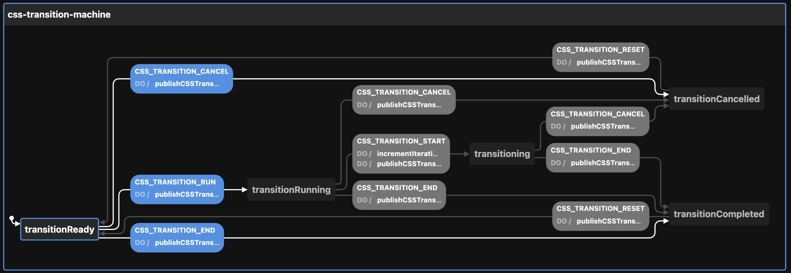

# Creating the CSSTransition state machine

View the [Visualization](https://stately.ai/viz/23997db9-29ef-498a-9a7d-38e218a24640). See the `index.test.tsx` file for examples of use.

Calling `createCSSTransitionMachineConfig` thus:

```ts
createCSSTransitionMachineConfig({
  enabledEvents: [
    "CSS_TRANSITION_CANCEL",
    "CSS_TRANSITION_END",
    "CSS_TRANSITION_RESET",
    "CSS_TRANSITION_RUN",
    "CSS_TRANSITION_START",
  ],                             // will publish to event bus on these transitions
  id: "css-transition-machine",  // defaults to generateShortId; should be unique
  initial: "transitionRunning",  // defaults to "transitionReady"
  iterations: 10,                // defaults to 0
  topic: "transitionTopic",      // used by the publishCSSTransitionEvent action
})
```

Returns this:

```ts
{
  machine: {
    context: {
      iterations: 10,
      enabledEvents: [
        "CSS_TRANSITION_CANCEL",
        "CSS_TRANSITION_END",
        "CSS_TRANSITION_RESET",
        "CSS_TRANSITION_RUN",
        "CSS_TRANSITION_START",
      ],
      topic: "transitionTopic",
    },
    id: "css-transition-machine",
    initial: "transitionRunning",
    states: {
      transitionReady: {
        on: {
          CSS_TRANSITION_RUN: {
            actions: ["publishCSSTransitionEvent"],
            target: "transitionRunning",
          },
          CSS_TRANSITION_END: {
            actions: ["publishCSSTransitionEvent"],
            target: "transitionCompleted",
          },
          CSS_TRANSITION_CANCEL: {
            actions: ["publishCSSTransitionEvent"],
            target: "transitionCancelled",
          },
        },
      },
      transitionRunning: {
        on: {
          CSS_TRANSITION_START: {
            actions: ["incrementIterations", "publishCSSTransitionEvent"],
            target: "transitioning",
          },
          CSS_TRANSITION_END: {
            actions: ["publishCSSTransitionEvent"],
            target: "transitionCompleted",
          },
          CSS_TRANSITION_CANCEL: {
            actions: ["publishCSSTransitionEvent"],
            target: "transitionCancelled",
          },
        },
      },
      transitioning: {
        on: {
          CSS_TRANSITION_END: {
            actions: ["publishCSSTransitionEvent"],
            target: "transitionCompleted",
          },
          CSS_TRANSITION_CANCEL: {
            actions: ["publishCSSTransitionEvent"],
            target: "transitionCancelled",
          },
        },
      },
      transitionCancelled: {
        on: {
          CSS_TRANSITION_RESET: {
            actions: ["publishCSSTransitionEvent"],
            target: "transitionReady",
          },
        },
      },
      transitionCompleted: {
        on: {
          CSS_TRANSITION_RESET: {
            actions: ["publishCSSTransitionEvent"],
            target: "transitionReady",
          },
        },
      },
    },
  },
  actions: {
    incrementIterations: assign({
      iterations: (context) => context.iterations + 1,
    }),
    publishAnimationEvent: (context, event) => {
      const { enabledEvents = [], topic, ...rest } = context

      if ((enabledEvents).includes(event.type)) {
        publish({ eventName: event.type, data: { ...rest } }, { topic: topic })
      }
    },
  }
}
```

The optional `enabledEvents` determines which transitions will publish events to the Event Bus. Possible transitions include:

- CSS_TRANSITION_CANCEL
- CSS_TRANSITION_END
- CSS_TRANSITION_RESET
- CSS_TRANSITION_RUN
- CSS_TRANSITION_START

The above be passed to XState's `createMachine` function by separating the machine from the actions:

```ts
const { machine, actions } = createCSSTransitionMachineConfig()

const cssTransitionStateMachine = createMachine(machine, { actions })
```

But see `useMachines` for how this is meant to be used with React and a configuration object.

Here is the machine as seen by the visualizer:


