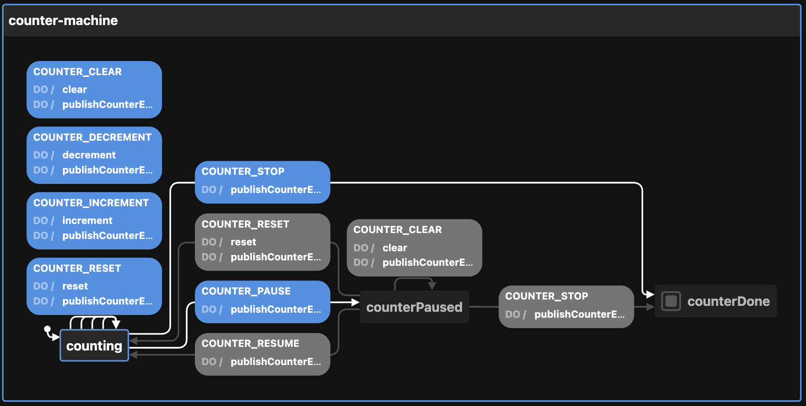

# Creating the Counter state machine

View the [Visualization](https://stately.ai/viz/b9b4330d-ad12-4e88-ac7b-9983e459b695). See the `index.test.tsx` file for examples of use.

Calling `createCounterMachineConfig` thus:

```ts
createCounterMachineConfig({
  count: 10,                 // defaults to 0; you can set the starting count
  enabledEvents: [
    "COUNTER_DECREMENT",
    "COUNTER_INCREMENT",
    "COUNTER_RESET"
  ],                         // will publish to event bus on these transitions
  id: "my-counter",          // defaults to generateShortId; should be unique
  increment: 5,              // defaults to 1; you can set the increment
  initial: "counterPaused",  // defaults to "counting"
  otherOption: "whatever",   // any other key-value pairs are simply passed to the context
  topic: "counter",          // used by the publishCounterEvent action
})
```

Returns this:

```ts
{
  machine:   {
    context: {
      count: 10,
      enabledEvents: [
        "COUNTER_DECREMENT",
        "COUNTER_INCREMENT",
        "COUNTER_RESET"
      ],
      increment: 5,
      otherOption: "whatever",
      topic: "counter",
      transitions: 0,
    },
    id: "my-counter",
    initial: "counterPaused",
    states: {
      counting: {
        on: {
          COUNTER_CLEAR: {
            actions: [
              "clear",
              "publishCounterEvent"
            ],
            target: "counting",
            internal: true
          },
          COUNTER_DECREMENT: {
            actions: [
              "decrement",
              "publishCounterEvent"
            ],
            target: "counting",
            internal: true
          },
          COUNTER_INCREMENT: {
            actions: [
              "increment",
              "publishCounterEvent"
            ],
            target: "counting",
            internal: true
          },
          COUNTER_PAUSE: {
            actions: [
              "publishCounterEvent"
            ],
            target: "counterPaused"
          },
          COUNTER_RESET: {
            actions: [
              "reset",
              "publishCounterEvent"
            ],
            target: "counting",
            internal: true
          },
          COUNTER_STOP: {
            actions: [
              "publishCounterEvent"
            ],
            target: "counterDone"
          }
        }
      },
      counterPaused: {
        on: {
          COUNTER_CLEAR: {
            actions: [
              "clear",
              "publishCounterEvent"
            ]
          },
          COUNTER_STOP: {
            actions: [
              "publishCounterEvent"
            ],
            target: "counterDone"
          },
          COUNTER_RESUME: {
            actions: [
              "publishCounterEvent"
            ],
            target: "counting",
            internal: true
          },
          COUNTER_RESET: {
            actions: [
              "reset",
              "publishCounterEvent"
            ],
            target: "counting",
            internal: true
          }
        }
      },
      counterDone: {
        type: "final"
      }
    },
    actions: {
      clear: assign({
        count: (_) => 0,
        transitions: (context) => context.transitions + 1,
      }),
      decrement: assign({
        count: (context) => context.count - context.increment,
        transitions: (context) => context.transitions + 1,
      }),
      increment: assign({
        count: (context) => context.count + context.increment,
        transitions: (context) => context.transitions + 1,
      }),
      publishCounterEvent: (context, event) => {
        const { enabledEvents = [], topic, ...rest } = context;

        if (enabledEvents.includes(event.type)) {
          publish(
            { eventName: event.type, data: { ...rest } },
            { topic: topic }
          );
        }
      },
      reset: assign({
        count: (_) => 0,
        transitions: (_) => 0,
      }),
    },
  }
}
```

The optional `enabledEvents` determines which transitions will publish events to the Event Bus. Possible transitions include:

- COUNTER_CLEAR
- COUNTER_DECREMENT
- COUNTER_INCREMENT
- COUNTER_PAUSE
- COUNTER_RESET
- COUNTER_RESUME
- COUNTER_STOP

The above be passed to XState's `createMachine` function by separating the machine from the actions:

```ts
const { machine, actions } = createCounterMachineConfig()

const animationStateMachine = createMachine(machine, { actions })
```

But see `useMachines` for how this is meant to be used with React and a configuration object.

Here is the machine as seen by the visualizer:


