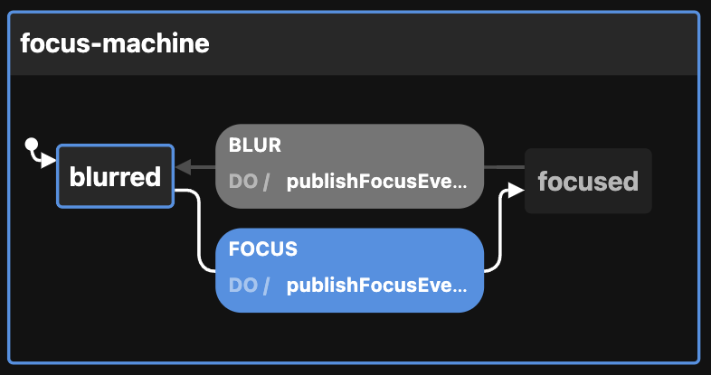

# Creating the Focus state machine

View the [Visualization](https://stately.ai/viz/bd6774bf-923d-40e9-ab5e-0ec5b29597e2). See the `index.test.tsx` file for examples of use.

Calling `createFocusMachineConfig` thus:

```ts
createFocusMachineConfig({
  enabledEvents: [
    "BLUR",
    "FOCUS",
  ],                        // will publish to event bus on these transitions
  id: "my-focus",           // defaults to generateShortId; should be unique
  initial: "focused",       // defaults to "blurred"
  otherOption: "whatever",  // any other key-value pairs are simply passed to the context
  topic: "focusTopic",      // used by the publishFocusEvent action
})
```

Returns this:

```ts
{
  machine: {
    context: {
      enabledEvents: ["BLUR", "FOCUS"],
      otherOption: "whatever",
      topic: "focusTopic",
    },
    id: "my-focus",
    initial: "focused",
    states: {
      blurred: {
        on: {
          FOCUS: {
            actions: ["publishFocusEvent"],
            target: "focused",
          },
        },
      },
      focused: {
        on: {
          BLUR: {
            actions: ["publishFocusEvent"],
            target: "blurred",
          },
        },
      },
    },
  },
  actions: {
    publishAnimationEvent: (context, event) => {
      const { enabledEvents = [], topic, ...rest } = context

      if ((enabledEvents).includes(event.type)) {
        publish({ eventName: event.type, data: { ...rest } }, { topic: topic })
      }
    },
  }
}
```

The optional `enabledEvents` determines which transitions will publish events to the Event Bus. Possible transitions include:

- BLUR
- FOCUS

The above be passed to XState's `createMachine` function by separating the machine from the actions:

```ts
const { machine, actions } = createFocusMachineConfig()

const focusStateMachine = createMachine(machine, { actions })
```

But see `useMachines` for how this is meant to be used with React and a configuration object.

Here is the machine as seen by the visualizer:


