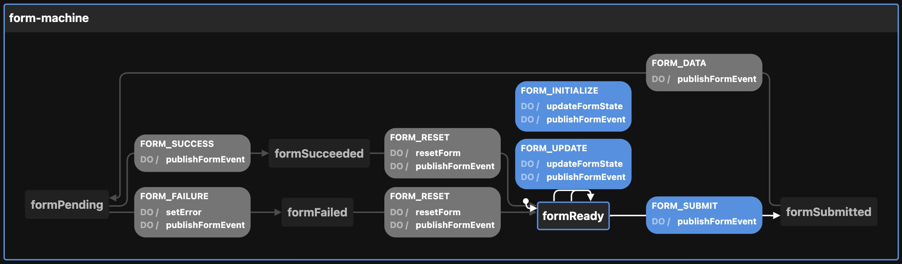

# Creating the Form state machine

View the [Visualization](https://stately.ai/viz/a74bf027-5e60-4047-a60a-86833dac90c3). See the `index.test.tsx` file for examples of use.

Calling `createFormMachineConfig` thus:

```ts
createFormMachineConfig({
  enabledEvents: [
    "FORM_FAILURE",
    "FORM_INITIALIZE",
    "FORM_RESET",
    "FORM_SUBMIT",
    "FORM_SUCCESS",
    "FORM_UPDATE",
  ],                         // will publish to event bus on these transitions
  error: "Some error",       // defaults to undefined
  fields: {
    nameGiven: {
      initialValue: "Bob",
      value: "Bob",
    },
  },                         // defaults to {}
  id: "form-machine",        // defaults to generateShortId; should be unique
  initial: "formPending",    // defaults to "formReady"
  otherOption: "whatever",   // any other key-value pairs are simply passed to the context
  topic: "topicName",        // used by the publishFormEvent action
})
```

Returns this:

```ts
{
  machine: {
    context: {
      error: "Some error",
      enabledEvents: [
        "FORM_FAILURE",
        "FORM_INITIALIZE",
        "FORM_RESET",
        "FORM_SUBMIT",
        "FORM_SUCCESS",
        "FORM_UPDATE",
      ],
      fields: {
        nameGiven: {
          initialValue: "Bob",
          value: "Bob",
        },
      },
      topic: "topicName",
    },
    id: "form-machine",
    initial: "formPending",
    states: {
      formReady: {
        on: {
          FORM_SUBMIT: {
            actions: ["publishFormEvent"],
            target: "formSubmitted",
          },
          FORM_INITIALIZE: {
            actions: ["updateFormState", "publishFormEvent"],
          },
          FORM_UPDATE: {
            actions: ["updateFormState", "publishFormEvent"],
          },
        },
      },
      formSubmitted: {
        on: {
          FORM_DATA: {
            actions: ["publishFormEvent"],
            target: "formPending",
          },
        },
      },
      formPending: {
        on: {
          FORM_SUCCESS: {
            actions: ["publishFormEvent"],
            target: "formSucceeded",
          },
          FORM_FAILURE: {
            actions: ["setError", "publishFormEvent"],
            target: "formFailed",
          },
        },
      },
      formFailed: {
        on: {
          FORM_RESET: {
            actions: ["resetForm", "publishFormEvent"],
            target: "formReady",
          },
        },
      },
      formSucceeded: {
        on: {
          FORM_RESET: {
            actions: ["resetForm", "publishFormEvent"],
            target: "formReady",
          },
        },
      },
    },
  },
  actions: {
    publishFormEvent: (context, event) => {
      const { enabledEvents = [], topic, ...rest } = context

      if (enabledEvents.includes(event.type)) {
        publish({ eventName: event.type, data: { ...rest } }, { topic: topic as string })
      }
    },
    setError: assign({
      error: (_, event) => (event as Event).error,
    }),
    resetForm: assign({
      error: (context) => undefined,
      fields: (context) => context.fields
    }),
    updateFormState: assign({
      fields: (context, event) => {
        return {
          ...context.fields,
          ...(event as Event).fields,
        }
      },
    }),
  },
}
```

The optional `enabledEvents` determines which transitions will publish events to the Event Bus. Possible transitions include:

- FORM_DATA
- FORM_FAILURE
- FORM_INITIALIZE
- FORM_RESET
- FORM_SUBMIT
- FORM_SUCCESS
- FORM_UPDATE

The above be passed to XState's `createMachine` function by separating the machine from the actions:

```ts
const { machine, actions } = createFormMachineConfig()

const formStateMachine = createMachine(machine, { actions })
```

But see `useMachines` for how this is meant to be used with React and a configuration object.

Here is the machine as seen by the visualizer:


