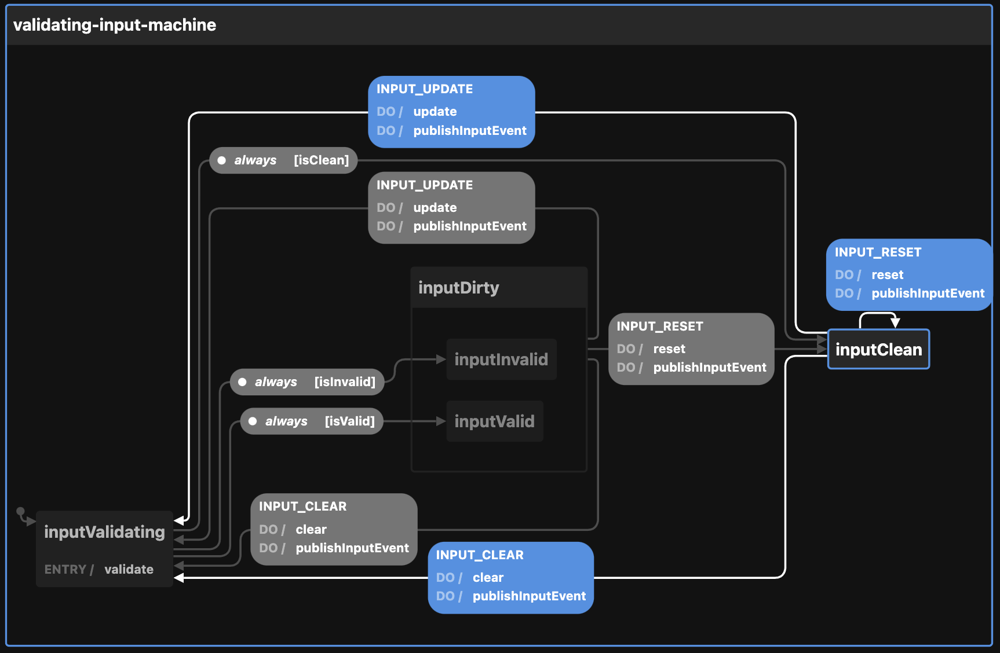
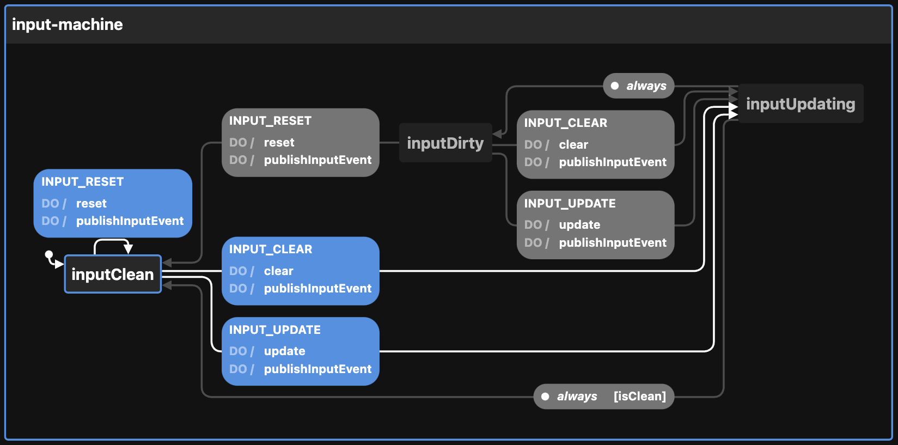

# Creating the Input state machine

View the visualization for the machine [without validation](https://stately.ai/viz/e3533a1a-d495-4d05-88b2-6656970b8a1b) and [with validation](https://stately.ai/viz/290891a3-ed95-42f8-a04c-e20cfb607c3e). See the `index.test.tsx` file for examples of use.

Calling `createInputMachineConfig` thus:

```ts
createInputMachineConfig({
  enabledEvents: ["INPUT_UPDATE"],
  id: "validating-input-machine",     // defaults to a generateShortId; should be unique
  initial: "inputValidating",         // defaults to "inputClean"
  initialValue: "Suyi",               // defaults to ""
  name: "givenName",                  // defaults to "input"; should be unique in form
  otherOption: "whatever",            // any other key-value pairs are simply passed to the context
  topic: "topicName",                 // used by the publishInputEvent action
  validate,                           // optional validation function
})
```

The optional validation function looks like `function validate(validation: Validation): Validation { ... }` where Validation is:

```ts
type Validation = {
  errors?: Array<string>
  isInvalid?: boolean
  value: string
}
```

The validation function is similarly composable from AND, OR, XOR, and various validators such as `

**If a validator is provided, then the machine includes validation states**. If not, then it does not.

The above call to `createInputMachineConfig` returns this:

```ts
{
  machine: {
    context: {
      enabledEvents: ["INPUT_UPDATE"],
      id: "validating-input-machine",
      initialValue: "Suyi",
      isInvalid: false,
      name: "givenName",
      otherOption: "whatever",
      topic: "topicName",
      validate,
      value: "Suyi", // on generation set to initialValue
    },
    id: "validating-input-machine",
    initial: "inputValidating",
    states: {
      inputClean: {
        on: {
          INPUT_CLEAR: {
            actions: ["clear", "publishInputEvent"],
            target: "inputValidating",
          },
          INPUT_RESET: {
            actions: ["reset", "publishInputEvent"],
            target: "inputClean",
            internal: false,
          },
          INPUT_UPDATE: {
            actions: ["update", "publishInputEvent"],
            target: "inputValidating",
          },
        },
      },
      inputDirty: {
        on: {
          INPUT_CLEAR: {
            actions: ["clear", "publishInputEvent"],
            target: "inputValidating",
          },
          INPUT_RESET: {
            actions: ["reset", "publishInputEvent"],
            target: "inputClean",
            internal: false,
          },
          INPUT_UPDATE: {
            actions: ["update", "publishInputEvent"],
            target: "inputValidating",
          },
        },
        states: {
          inputValid: {},
          inputInvalid: {},
        },
      },
      inputValidating: {
        entry: ["validate"],
        always: [
          {
            cond: "isClean",
            target: "inputClean",
          },
          {
            cond: "isValid",
            target: "inputDirty.inputValid",
          },
          {
            cond: "isInvalid",
            target: "inputDirty.inputInvalid",
          },
        ],
      },
    },
  },
  actions: {
    clear: assign({
      value: () => "",
    }),
    publishInputEvent: (context, event) => {
      const { enabledEvents = [], topic, ...rest } = context;

      if (enabledEvents.includes(event.type)) {
        publish(
          { eventName: event.type, data: { ...rest } },
          { topic: topic }
        );
      }
    },
    reset: assign({
      isInvalid: () => false,
      value: (context) => context.initialValue || "",
    }),
    validate: assign((context) =>
      context.validate
        ? {
          ...context,
          ...context.validate({ value: context.value }),
        }
        : context
    ),
    update: assign({
      value: (_, event) => event.value,
    }),
  },
  guards: {
    isClean: (context) => context.value === context.initialValue,
    isInvalid: (context) => Boolean(context.isInvalid),
    isValid: (context) => not(context.isInvalid),
  },
}
```

The optional `enabledEvents` determines which transitions will publish events to the Event Bus. Possible transitions include:

- INPUT_CLEAR
- INPUT_RESET
- INPUT_UPDATE

The above be passed to XState's `createMachine` function by separating the machine from the actions:

```ts
const { machine, actions, guards } = createInputMachineConfig()

const inputStateMachine = createMachine(machine, { actions, guards })
```

You can create a non-validating version like this:

```ts
createInputMachineConfig({
  enabledEvents: ["INPUT_CLEAR", "INPUT_RESET", "INPUT_UPDATE"],
  id: "input-machine",         // defaults to a generateShortId; should be unique
  initial: "inputUpdating",    // defaults to "inputClean"
  initialValue: "Bob",         // defaults to ""
  name: "givenName",           // defaults to "input"; should be unique in form
  topic: "topicName",          // used by the publishInputEvent action
  // do not pass `validate` function
})
```

Which gives you this:

```ts
{
  machine: {
    context: {
      enabledEvents: ["INPUT_CLEAR", "INPUT_RESET", "INPUT_UPDATE"],
      errors: [],
      id: "input-machine",
      initialValue: "Bob",
      isInvalid: false,
      name: "givenName",
      value: "Bob",
      topic: "inputTopic",
    },
    id: "input-machine",
    initial: "inputUpdating",
    states: {
      inputClean: {
        on: {
          INPUT_CLEAR: {
            actions: ["clear", "publishInputEvent"],
            target: "inputUpdating",
          },
          INPUT_RESET: {
            actions: ["reset", "publishInputEvent"],
            target: "inputClean",
            internal: false,
          },
          INPUT_UPDATE: {
            actions: ["update", "publishInputEvent"],
            target: "inputUpdating",
          },
        },
      },
      inputDirty: {
        on: {
          INPUT_CLEAR: {
            actions: ["clear", "publishInputEvent"],
            target: "inputUpdating",
          },
          INPUT_RESET: {
            actions: ["reset", "publishInputEvent"],
            target: "inputClean",
            internal: false,
          },
          INPUT_UPDATE: {
            actions: ["update", "publishInputEvent"],
            target: "inputUpdating",
          },
        },
      },
      inputUpdating: {
        always: [
          {
            cond: "isClean",
            target: "inputClean",
          },
          {
            target: "inputDirty",
          },
        ],
      },
    },
  },
  actions: {
    clear: assign({
      value: () => "",
    }),
    publishInputEvent: (context, event) => {
      const { enabledEvents = [], topic, ...rest } = context;

      if (enabledEvents.includes(event.type)) {
        publish(
          { eventName: event.type, data: { ...rest } },
          { topic: topic }
        );
      }
    },
    reset: assign({
      errors: () => [],
      isInvalid: () => false,
      value: (context) => context.initialValue,
    }),
    update: assign({
      value: (_, event) => event.value,
    }),
  },
  guards: {
    isClean: (context) => context.value === context.initialValue,
  },
}
```

But see `useMachines` for how this is meant to be used with React and a configuration object.

And here is the validating input machine:



Here is the machine as seen by the visualizer:


