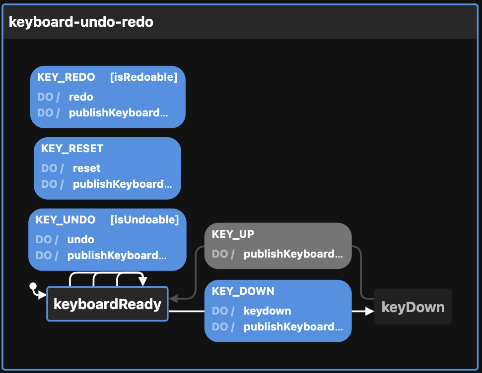

# Creating the Keyboard state machine

View the visualization of the machine [without undo/redo](https://stately.ai/viz/0accb564-3584-491c-b588-d3c0c0ab2fe3) and [with undo/redo](https://stately.ai/viz/7ba9606a-442a-4d0b-9fcb-b64483555783)

Calling `createKeyboardMachineConfig` thus:

```ts
createKeyboardMachineConfig({
  enabledEvents: [
   "KEY_DOWN",
   "KEY_REDO",
   "KEY_RESET",
   "KEY_UNDO",
   "KEY_UP",
  ],                         // will publish to event bus on these transitions
  id: "keyboard-undo-redo",  // defaults to generateShortId; should be unique
  initial: "keyDown",        // defaults to "keyboardReady"
  otherOption: "whatever",   // any other key-value pairs are simply passed to the context
  topic: "topicName",        // used by the publishKeyboardEvent action
})
```

Returns this:

```ts
{
  machine: {
    context: {
      key: {
        key: undefined,
      },
      otherOption: "whatever",
      redo: [],
      undo: [],
      enabledEvents: [
        "KEY_DOWN",
        "KEY_REDO",
        "KEY_RESET",
        "KEY_UNDO",
        "KEY_UP",
      ],
      topic: "topicName",
    },
    id: "keyboard-undo-redo",
    initial: "keyDown",
    states: {
      keyboardReady: {
        on: {
          KEY_DOWN: {
            actions: ["keydown", "publishKeyboardEvent"],
            target: "keyDown",
          },
          KEY_REDO: {
            actions: ["redo", "publishKeyboardEvent"],
            cond: "isRedoable",
          },
          KEY_RESET: {
            actions: ["reset", "publishKeyboardEvent"],
          },
          KEY_UNDO: {
            actions: ["undo", "publishKeyboardEvent"],
            cond: "isUndoable",
          },
        },
      },
      keyDown: {
        on: {
          KEY_UP: {
            actions: ["publishKeyboardEvent"],
            target: "keyboardReady",
          },
        },
      },
    },
  },
  actions: {
    keydown: assign({
      key: (_, event) => event.key,
      undo: (context) => [context.key, ...context.undo],
      redo: () => [],
    }),
    publishKeyboardEvent: (context, event) => {
      const { enabledEvents = [], topic, ...rest } = context

      if (enabledEvents.includes(event.type)) {
        // Publish to event bus
        publish({ eventName: event.type, data: { ...rest } }, { topic })
      }
    },
    redo: assign({
      key: ({ redo: [first] }) => first,
      redo: ({ redo: [, ...rest] }) => rest,
      undo: ({ key, undo }) => [key, ...undo],
    }),
    reset: assign({
      key: () => ({ key: undefined }),
      redo: () => [],
      undo: () => [],
    }),
    undo: assign({
      key: (context) => context.undo?.[0],
      redo: ({ key, redo }) => [key, ...redo],
      undo: ({ undo: [, ...rest] }) => rest,
    }),
  },
  guards: {
    isRedoable: ({ redo }) => Boolean(redo.length),
    isUndoable: ({ undo }) => Boolean(undo.length),
  },
}
```

The optional `enabledEvents` determines which transitions will publish events to the Event Bus. Possible transitions include:

- KEY_DOWN
- KEY_REDO
- KEY_RESET
- KEY_UNDO
- KEY_UP

The above be passed to XState's `createMachine` function by separating the machine from the actions:

```ts
const { machine, actions, guards } = createKeyboardMachineConfig()

const keyboardStateMachine = createMachine(machine, { actions, guards })
```

But see `useMachines` for how this is meant to be used with React and a configuration object.

You can also create the machine without undo/redo thus:

```ts
createKeyboardMachineConfig({
  id: "keyboard-machine",  // defaults to generateShortId; should be unique
  topic: "TOPIC",          // used by the publishKeyboardEvent action
})
```

Which yields:

```ts
{
  machine: {
    context: {
      key: {
        key: undefined as string | undefined,
      },
      redo: [],
      undo: [],
      enabledEvents: [
        "KEY_DOWN",
        "KEY_RESET",
        "KEY_UP"
      ],
      topic: "TOPIC",
    },
    id: "keyboard-machine",
    initial: "keyDown",
    states: {
      keyboardReady: {
        on: {
          KEY_DOWN: {
            actions: ["keydown", "publishKeyboardEvent"],
            target: "keyDown",
          },
          KEY_RESET: {
            actions: ["reset", "publishKeyboardEvent"],
          },
        },
      },
      keyDown: {
        on: {
          KEY_UP: {
            actions: ["publishKeyboardEvent"],
            target: "keyboardReady",
          },
        },
      },
    },
  },
  actions: {
    keydown: assign({
      key: (_, event) => event.key,
    }),
    publishKeyboardEvent: (context, event) => {
      const { enabledEvents = [], topic, ...rest } = context

      if (enabledEvents.includes(event.type)) {
       publish({ eventName: event.type, data: { ...rest } }, { topic })
      }
     },
    reset: assign({
      key: () => ({ key: undefined }),
    }),
  },
}
```

Here is the machine **without undo/redo** as seen by the visualizer:


Here is the machine **with undo/redo** as seen by the visualizer:


