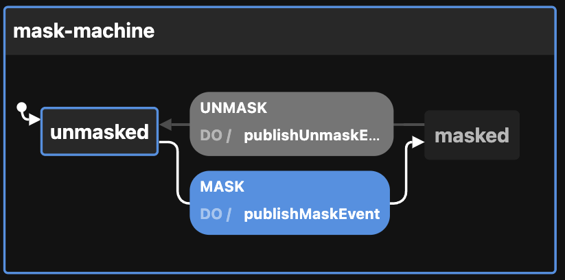
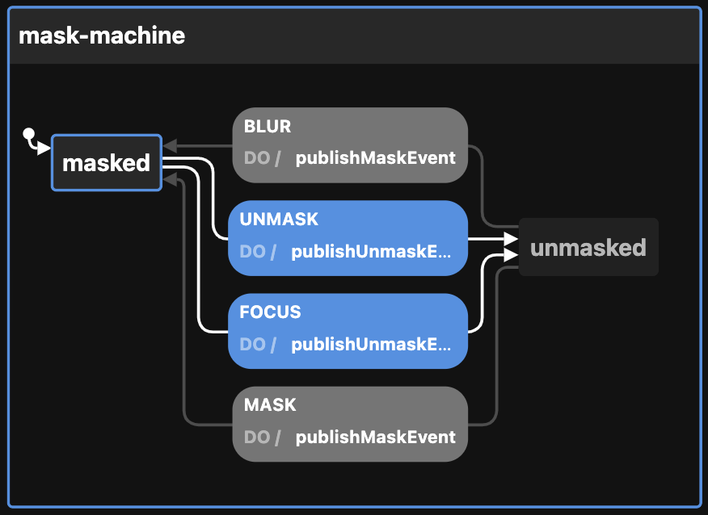

# Creating the Mask state machine

View the [Visualization](https://stately.ai/viz/43407874-85a6-4745-abcc-ac45b2ee500d). See the `index.test.tsx` file for examples of use.

Calling `createMaskMachineConfig` thus:

```ts
createMaskMachineConfig({
  enabledEvents: [
    "MASK",
    "UNMASK",
  ],                         // will publish to event bus on these transitions
  id: "mask-machine",        // defaults to generateShortId; should be unique
  initial: "masked",         // defaults to "unmasked"
})
```

Returns this:

```ts
{
  machine: {
    context: {
      enabledEvents: [
        "MASK",
        "UNMASK",
      ],
      topic: "topic",
    },
    id: "mask-machine",
    initial: "masked",
    states: {
      unmasked: {
        on: {
          MASK: {
            actions: ["publishMaskEvent"],
            target: "masked",
          },
        },
      },
      masked: {
        on: {
          UNMASK: {
            actions: ["publishUnmaskEvent"],
            target: "unmasked",
          },
        },
      },
    },
  },
  actions: {
    publishMaskEvent: (context, event) => {
      const { enabledEvents = [], topic, ...rest } = context;

      if (enabledEvents.includes(event.type)) {
        publish({ eventName: "MASK", data: { ...rest } }, { topic: topic });
      }
    },
    publishUnmaskEventEvent: (context, event) => {
      const { enabledEvents = [], topic, ...rest } = context;

      if (enabledEvents.includes(event.type)) {
        publish({ eventName: "UNMASK", data: { ...rest } }, { topic: topic });
      }
    },
  },
}
```

We can also tell the machine to mask (or unmask) on BLUR or FOCUS, which is probably how it will normally be used. So, calling `createMaskMachineConfig` thus:

```ts
createMaskMachineConfig({
  enabledEvents: [
    "BLUR",
    "FOCUS",
    "MASK",
    "UNMASK",
  ],                              // will publish to event bus on these transitions
  id: "mask-machine-with-focus",  // defaults to generateShortId; should be unique
  maskTrigger: "ON_BLUR",         // optional; defaults to undefined (alternately, ON_FOCUS)
  topic: "topicName",             // used by the publishMaskEvent and publishUnmaskEvent actions
})
```

Returns this:

```ts
{
  machine:
  {
    context: {
      enabledEvents: ["FOCUS", "BLUR", "UNMASK", "MASK"],
      maskTrigger: "ON_BLUR",
      topic: "topicName",
    },
    id: "mask-machine-with-focus",
    initial: "unmasked",
    states: {
      unmasked: {
        on: {
          MASK: {
            actions: ["publishMaskEvent"],
            target: "masked",
          },
          // if maskTrigger is `ON_FOCUS`, then this is FOCUS instead
          BLUR: {
            actions: ["publishMaskEvent"],
            target: "masked",
          },
        },
      },
      masked: {
        on: {
          UNMASK: {
            actions: ["publishUnmaskEvent"],
            target: "unmasked",
          },
          // if maskTrigger is `ON_FOCUS`, then this is BLUR instead
          FOCUS: {
            actions: ["publishUnmaskEvent"],
            target: "unmasked",
          },
        },
      },
    },
  },
  actions: {
    publishMaskEvent: (context, event) => {
      const { enabledEvents = [], topic, ...rest } = context

      if ((enabledEvents).includes(event.type)) {
        publish({ eventName: "MASK", data: { ...rest } }, { topic: topic })
      }
    },
    publishUnmaskEvent: (context, event) => {
      const { enabledEvents = [], topic, ...rest } = context

      if ((enabledEvents).includes(event.type)) {
        publish({ eventName: "UNMASK", data: { ...rest } }, { topic: topic })
      }
    },
  }
}
```

**IMPORTANT NOTE:**

Setting `maskTrigger` to "ON_FOCUS" will swap the `BLUR` and `FOCUS` transitions above so that masking occurs on "FOCUS". Leaving `maskTrigger` undefined will remove the `BLUR` and `FOCUS` transitions leaving only `MASK` and `UNMASK`.

The reason for `maskTrigger` is that masking is typically used on HTML inputs and is toggled on and off. For example, an account number input could be masked until it is focused, then re-masked on blur. On the other hand, a password field might use a toggle button (icon) and the `MASK` and `UNMASK` transitions to hide and show the password, respectively.

The optional `enabledEvents` determines which transitions will publish events to the Event Bus. Possible transitions include:

- BLUR (from FocusMachine)
- FOCUS (from FocusMachine)
- MASK
- UNMASK

`BLUR` and `FOCUS` are only available if `maskTrigger` is set (to `ON_BLUR` or `ON_FOCUS`).

The above be passed to XState's `createMachine` function by separating the machine from the actions:

```ts
const { machine, actions } = createMaskMachineConfig()

const maskStateMachine = createMachine(machine, { actions })
```

But see `useMachines` for how this is meant to be used with React and a configuration object.

Here is the basic mask machine as seen by the visualizer. Swap BLUR and FOCUS if the maskTrigger is `ON_FOCUS`.



And here is the machine with BLUR/FOCUS as seen by the visualizer. Swap the BLUR and FOCUS transitions if maskTrigger is set to `ON_FOCUS` instead.


