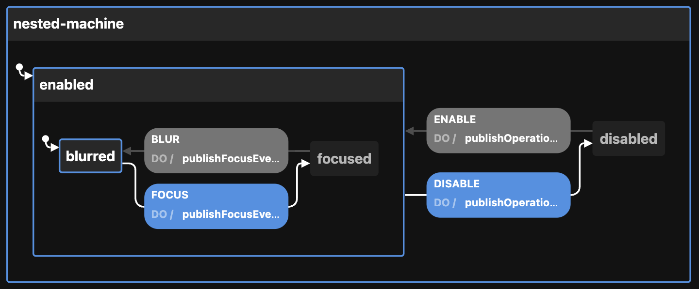

# Creating the Nested state machine

View the [Visualization](https://stately.ai/viz/0f188474-67a6-4d19-a407-2e0560e4f915). See the `index.test.tsx` file for examples of use.

Calling `createNestedMachineConfig` thus:

```ts
createNestedMachineConfig({
  NESTED: {
    child: {                      // this machine (focus) will be nested in the parent (operation)
      FOCUS: {
        id: "focus-machine",
        bob: "Dobbs",
      },
    },
    enabledEvents: [              // publishing of events from either or both machines can be enabled
      "BLUR",
      "DISABLE",
      "ENABLE",
      "FOCUS",
    ],                            // will publish to event bus on these transitions
    id: "nested-machine",         // defaults to generateShortId; should be unique
    initial: "enabled",           // defaults to "enabled"
    injectInto: "enabled",        // the child machine will be injected into the enabled state of the parent
    otherOption: "whatever",      // any other key-value pairs are simply passed to the context
    parent: {
      OPERATION: {                // this machine (operation) will wrap the child machine (focus)
        id: "operation-machine",
        sam: "Spade",
      },
    },
    topic: "TOPIC",               // used by the publish...Event actions of the two machines
  }
})
```

Returns this:

```ts
{
  machine: {
    id: "nested-machine",
    initial: "enabled",
    context: {
      enabledEvents: ["BLUR", "DISABLE", "ENABLE", "FOCUS"],
      topic: "TOPIC",
    },
    states: {
      disabled: {
        on: {
          ENABLE: {
            actions: ["publishOperationEvent"],
            target: "enabled",
          },
        },
      },
      enabled: {
        on: {
          DISABLE: {
            actions: ["publishOperationEvent"],
            target: "disabled",
          },
        },
        states: {
          blurred: {
            on: {
              FOCUS: {
                actions: ["publishFocusEvent"],
                target: "focused",
              },
            },
          },
          focused: {
            on: {
              BLUR: {
                actions: ["publishFocusEvent"],
                target: "blurred",
              },
            },
          },
        },
        id: "focus-machine",
        initial: "blurred",
      },
    },
  },
  actions: {
    publishFocusEvent: (context, event) => {
      const { enabledEvents = [], topic, ...rest } = context

      if ((enabledEvents).includes(event.type)) {
        publish({ eventName: event.type, data: { ...rest } }, { topic: topic })
      }
    },
    publishOperationEvent: (context, event) => {
      const { enabledEvents = [], topic, ...rest } = context

      if ((enabledEvents).includes(event.type)) {
        publish({ eventName: event.type, data: { ...rest } }, { topic: topic })
      }
    },
  },
}
```

This can be passed to XState's `createMachine` function by separating the machine from the actions:

```ts
const { machine, actions } = createNestedMachineConfig()

const nestedStateMachine = createMachine(machine, { actions })
```

But see `useMachines` for how this is meant to be used with React and a configuration object.

Here is the machine as seen by the visualizer:


