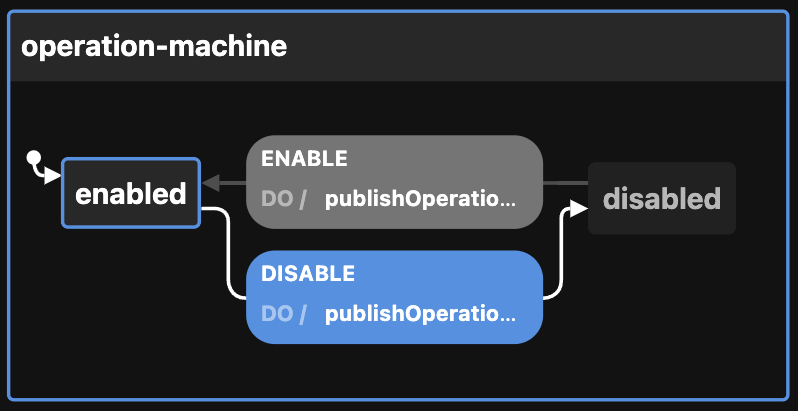

# Creating the Operation state machine

View the [Visualization](https://stately.ai/viz/1f9235cd-cff5-4ec3-bd33-24a8e1bd9480). See the `index.test.tsx` file for examples of use.

Calling `createOperationMachineConfig` thus:

```ts
createToggleMachineConfig({
  enabledEvents: [
    "DISABLE",
    "ENABLE",
  ],                         // will publish to event bus on these transitions
  id: "operation-machine",   // defaults to generateShortId; should be unique
  initial: "disabled",       // defaults to "enabled"
  otherOption: "whatever",   // any other key-value pairs are simply passed to the context
  topic: "topicName",        // used by the publishOperationEvent action
})
```

Returns this:

```ts
[
  {
    machine: {
      context: {
        enabledEvents: [
          "DISABLE",
          "ENABLE",
        ],
        otherOption: "whatever",
        topic: "topicName",
      },
      id: "operation-machine",
      initial: "disabled",
      states: {
        disabled: {
          on: {
            ENABLE: {
              actions: ["publishOperationEvent"],
              target: "enabled",
            },
          },
        },
        enabled: {
          on: {
            DISABLE: {
              actions: ["publishOperationEvent"],
              target: "disabled",
            },
          },
          states: {}, // Nested states can be inserted here
        },
      },
    },
  },
  {
    actions: {
      publishOperationEvent: (context, event) => {
        const { enabledEvents = [], topic, ...rest } = context

        if (enabledEvents.includes(event.type)) {
          publish({ eventName: event.type, data: { ...rest } }, { topic })
        }
      },
    },
  }
]
```

The optional `enabledEvents` determines which transitions will publish events to the Event Bus. Possible transitions include:

- DISABLE
- ENABLE

The above be passed to XState's `createMachine` function by separating the machine from the actions:

```ts
const { machine, actions } = createOperationMachineConfig()

const operationStateMachine = createMachine(machine, { actions })
```

Here is the machine as seen by the visualizer:


