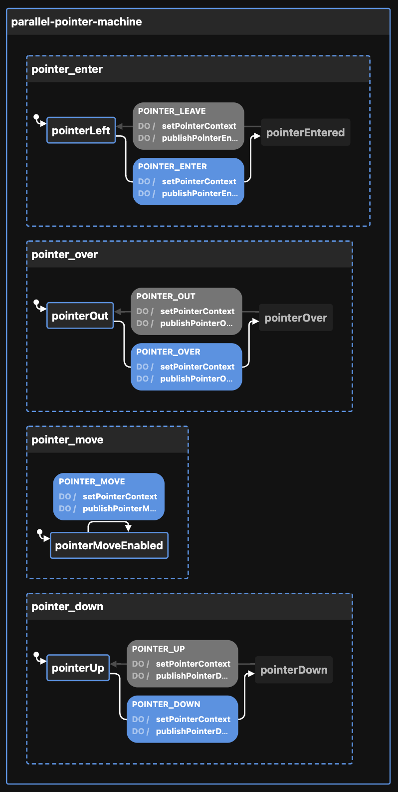

# Creating the Parallel state machine

[Visualization](https://stately.ai/viz/???)

Calling `createParallelMachineConfig` thus:

```ts
{
  PARALLEL: {
    id: "parallel-pointer-machine",
    enabledEvents: [                 // publishing of events from any or all machines can be enabled
      "POINTER_DOWN",
      "POINTER_ENTER",
      "POINTER_LEAVE",
      "POINTER_MOVE",
      "POINTER_OUT",
      "POINTER_OVER",
      "POINTER_UP",
    ],
    children: {                      // these machines will be placed in parallel
      POINTER_DOWN: {
        id: "down-machine",
        initial: "pointerDown",      // can pass any config options for machine to each machine
        pointerTracking: [           // pass this on only one of the pointer machines
          "client",
          "keys",
          "screen",
        ],
      },
      POINTER_ENTER: {
        id: "enter-machine",
      },
      POINTER_MOVE: {
        id: "move-machine",
      },
      POINTER_OVER: {
        id: "over-machine",
      },
    },
    topic: "TOPIC",                  // the topic is used for all publish...Events
  }
}
```

Returns this:

```ts
{
  machine: {
    context: {
      pointerTracking: [
        "client",
        "keys",
        "screen"
      ],
      pointer: {                     // pointer is initialized from properties set by pointerTracking
        clientX: null,
        clientY: null,
        altKey: null,
        ctrlKey: null,
        metaKey: null,
        shiftKey: null,
        screenX: null,
        screenY: null
      },
      id: "parallel-pointer-machine",
      enabledEvents: [
        "POINTER_DOWN",
        "POINTER_ENTER",
        "POINTER_LEAVE",
        "POINTER_MOVE",
        "POINTER_OUT",
        "POINTER_OVER",
        "POINTER_UP"
      ],
      topic: "TOPIC"
    },
    type: "parallel",
    states: {
      pointer_down: {
        id: "down-machine",
        initial: "pointerDown",
        states: {
          pointerUp: {
            on: {
              POINTER_DOWN: {
                actions: [
                  "setPointerContext",
                  "publishPointerDownEvent"
                ],
                target: "pointerDown"
              }
            }
          },
          pointerDown: {
            on: {
              POINTER_UP: {
                actions: [
                  "setPointerContext",
                  "publishPointerDownEvent"
                ],
                target: "pointerUp"
              }
            }
          }
        }
      },
      pointer_enter: {
        id: "enter-machine",
        initial: "pointerLeft",
        states: {
          pointerLeft: {
            on: {
              POINTER_ENTER: {
                actions: [
                  "setPointerContext",
                  "publishPointerEnterEvent"
                ],
                target: "pointerEntered"
              }
            }
          },
          pointerEntered: {
            on: {
              POINTER_LEAVE: {
                actions: [
                  "setPointerContext",
                  "publishPointerEnterEvent"
                ],
                target: "pointerLeft"
              }
            }
          }
        }
      },
      pointer_move: {
        id: "move-machine",
        initial: "pointerMoveEnabled",
        states: {
          pointerMoveEnabled: {
            on: {
              POINTER_MOVE: {
                actions: [
                  "setPointerContext",
                  "publishPointerMoveEvent"
                ]
              }
            }
          }
        }
      },
      pointer_over: {
        id: "over-machine",
        initial: "pointerOut",
        states: {
          pointerOut: {
            on: {
              POINTER_OVER: {
                actions: [
                  "setPointerContext",
                  "publishPointerOverEvent"
                ],
                target: "pointerOver"
              }
            }
          },
          pointerOver: {
            on: {
              POINTER_OUT: {
                actions: [
                  "setPointerContext",
                  "publishPointerOverEvent"
                ],
                target: "pointerOut"
              }
            }
          }
        }
      }
    }
  },
  actions: {
    setPointerContext: assign((_, event: PointerEvent) => getPointerContext(pointerTracking, event)),
  },
}
```

Some of the above is unique to pointer machines. See [initializePointerTracking](/src/services/useMachines/utilities/initializePointerContext/index.ts) and [setPointerContext](/src/services/useMachines/utilities/setPointerContext/index.ts) for more information.

This can be passed to XState's `createMachine` function by separating the machine from the actions:

```ts
const { machine, actions } = createParallelMachineConfig()

const parallelStateMachine = createMachine(machine, { actions })
```

But see `useMachines` for how this is meant to be used with React and a configuration object.

Here is the machine as seen by the visualizer:


