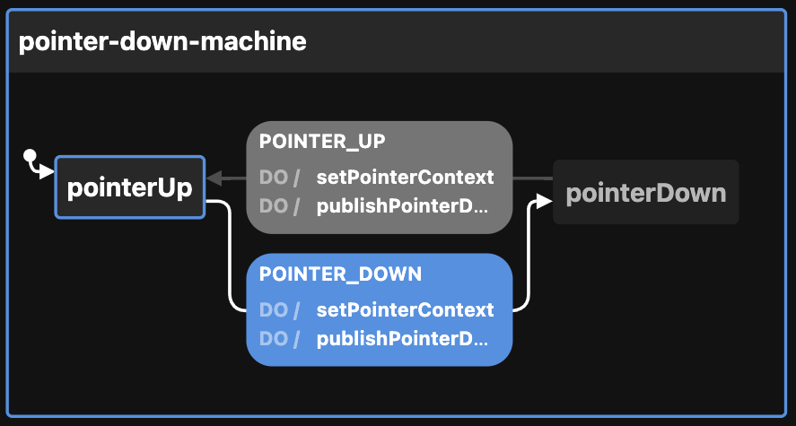

# Creating the PointerDown state machine

View the [Visualization](https://stately.ai/viz/f0037197-9b16-4ee2-8fec-8e1056443ef8). See the `index.test.tsx` file for examples of use.

Here are the pointer tracking options:

```ts
type PointerTracking =
  | "client"
  | "coords"
  | "keys"
  | "layer"
  | "movement"
  | "offset"
  | "page"
  | "pen"
  | "screen"
  | "tilt"
  | "type"
```

Here is what they track:

```ts
type Pointer = {
  // client
  clientX?: number
  clientY?: number

  // coords
  x?: number
  y?: number

  // keys
  altKey?: boolean
  ctrlKey?: boolean
  metaKey?: boolean
  shiftKey?: boolean

  // layer
  layerX?: number
  layerY?: number

  // movement
  movementX?: number
  movementY?: number

  // offset
  offsetX?: number
  offsetY?: number

  // page
  pageX?: number
  pageY?: number

  // pen
  altitudeAngle?: number
  azimuthAngle?: number
  pressure?: number
  tangentialPressure?: number
  twist?: number

  // screen
  screenX?: number
  screenY?: number

  // tilt
  tiltX?: number
  tiltY?: number

  // type
  composed?: boolean
  pointerType?: "mouse" | "pen" | "touch"
}
```

These are set on transition (POINTER_DOWN and POINTER_UP).

You call `createPointerDownMachineConfig` like this:

```ts
createPointerDownMachineConfig({
  enabledEvents: [
    "POINTER_DOWN",
    "POINTER_UP",
  ],                            // will publish to event bus on these transitions
  id: "pointer-down-machine",   // defaults to generateShortId; should be unique
  initial: "pointerDown",       // defaults to pointerUp
  otherOption: "whatever",      // any other key-value pairs are simply passed to the context
  pointerTracking = [
    "page",
    "pen",
  ],                            // defaults to ["keys", "client"]
  topic: "topicName",           // used by the publishPointerDownEvent action
})
```

Then returns this:

```ts
{
  machine: {
    context: {
      enabledEvents: ["POINTER_DOWN", "POINTER_UP"],
      otherOption: "whatever",
      pointer: {
        altitudeAngle: undefined,
        azimuthAngle: undefined,
        pageX: undefined,
        pageY: undefined,
        pressure: undefined,
        tangentialPressure: undefined,
        twist: undefined,
      },
      pointerTracking: ["page", "pen"],
      topic: "topicName",
    },
    id: "pointer-down-machine",
    initial: "pointerDown",
    states: {
      pointerUp: {
        on: {
          POINTER_DOWN: {
            actions: ["setPointerContext", "publishPointerDownEvent"],
            target: "pointerDown",
          },
        },
      },
      pointerDown: {
        on: {
          POINTER_UP: {
            actions: ["setPointerContext", "publishPointerDownEvent"],
            target: "pointerUp",
          },
        },
      },
    },
  },
  actions: {
    publishPointerEvent: (context, event) => {
      const { enabledEvents = [], topic, ...rest } = context

      if (enabledEvents.includes(event.type)) {
        publish({ eventName: event.type, data: { ...rest } }, { topic })
      }
    },
    // updates the pointer context (pageX, etc.)
    setPointerContext: assign({
      pointer: (context, event) => setPointerContext(context.pointer, event)
    }),
  },
}
```

This can be passed to XState's `createMachine` function by separating the machine from the actions:

```ts
const { machine, actions } = createPointerDownMachineConfig()

const pointerStateMachine = createMachine(machine, { actions })
```

But see `useMachines` for how this is meant to be used with React and a configuration object.

Here is the machine as seen by the visualizer:


