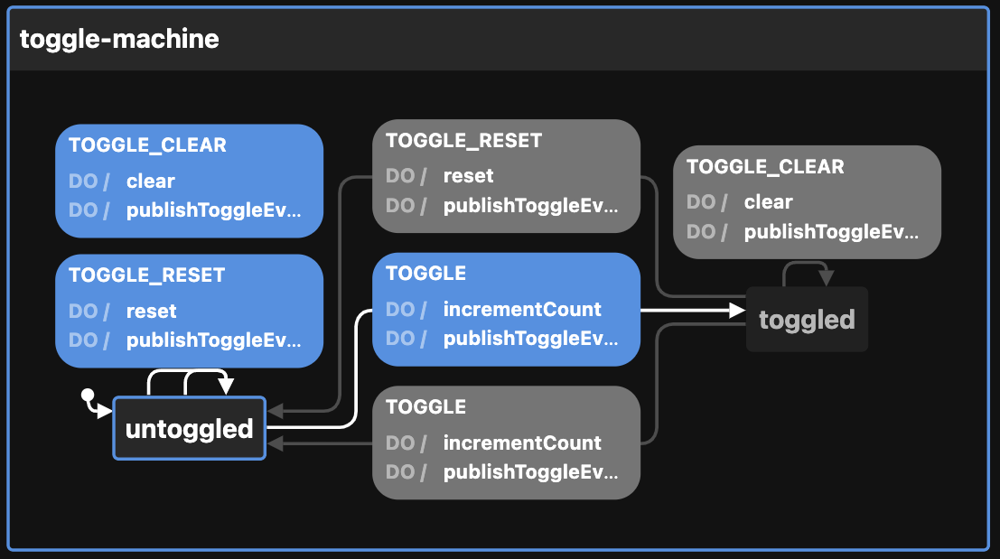

# Creating the Toggle state machine

View the [Visualization](https://stately.ai/viz/5267dcc9-5b06-48d5-9d73-bc311cabe741). See the `index.test.tsx` file for examples of use.

Calling `createToggleMachineConfig` thus:

```ts
createToggleMachineConfig({
  enabledEvents: [
    "TOGGLE",
    "TOGGLE_CLEAR",
    "TOGGLE_RESET",
  ],                         // will publish to event bus on these transitions
  id: "toggle-machine",      // defaults to generateShortId; should be unique
  initial: "toggled",        // defaults to "untoggled"
  otherOption: "whatever",   // any other key-value pairs are simply passed to the context
  toggleCount: 5,            // defaults to 0
  topic: "topicName",        // used by the publishToggleEvent action
})
```

Returns this:

```ts
{
  machine: {
    context: {
      enabledEvents: [
        "TOGGLE",
        "TOGGLE_CLEAR",
        "TOGGLE_RESET",
      ],
      otherOption: "whatever",
      toggleCount: 5,
      topic: "topicName",
    },
    id: "toggle-machine",
    initial: "toggled",
    states: {
      untoggled: {
        on: {
          TOGGLE: {
            actions: ["incrementCount", "publishToggleEvent"],
            target: "toggled",
          },
          TOGGLE_CLEAR: {
            actions: ["clear", "publishToggleEvent"],
          },
          TOGGLE_RESET: {
            actions: ["reset", "publishToggleEvent"],
            target: "toggled", // set to initial state
          },
        },
      },
      toggled: {
        on: {
          TOGGLE: {
            actions: ["incrementCount", "publishToggleEvent"],
            target: "untoggled",
          },
          TOGGLE_CLEAR: {
            actions: ["clear", "publishToggleEvent"],
          },
          TOGGLE_RESET: {
            actions: ["reset", "publishToggleEvent"],
            target: "toggled", // set to initial state
          },
        },
      },
    },
  },
  actions: {
    clear: assign({
      toggleCount: (_) => 0,
    }),
    incrementCount: assign({
      toggleCount: (context) => context.toggleCount + 1,
    }),
    publishToggleEvent: (context, event) => {
      const { enabledEvents = [], topic, ...rest } = context

      if (enabledEvents.includes(event.type)) {
        publish({ eventName: event.type, data: { ...rest } }, { topic: topic as string })
      }
    },
    reset: assign({
      toggleCount: (_) => toggleCount
    })
  },
}
```

The optional `enabledEvents` determines which transitions will publish events to the Event Bus. Possible transitions include:

- TOGGLE
- TOGGLE_CLEAR
- TOGGLE_RESET

The above be passed to XState's `createMachine` function by separating the machine from the actions:

```ts
const { machine, actions } = createToggleMachineConfig()

const toggleStateMachine = createMachine(machine, { actions })
```

But see `useMachines` for how this is meant to be used with React and a configuration object.

Here is the machine as seen by the visualizer:


