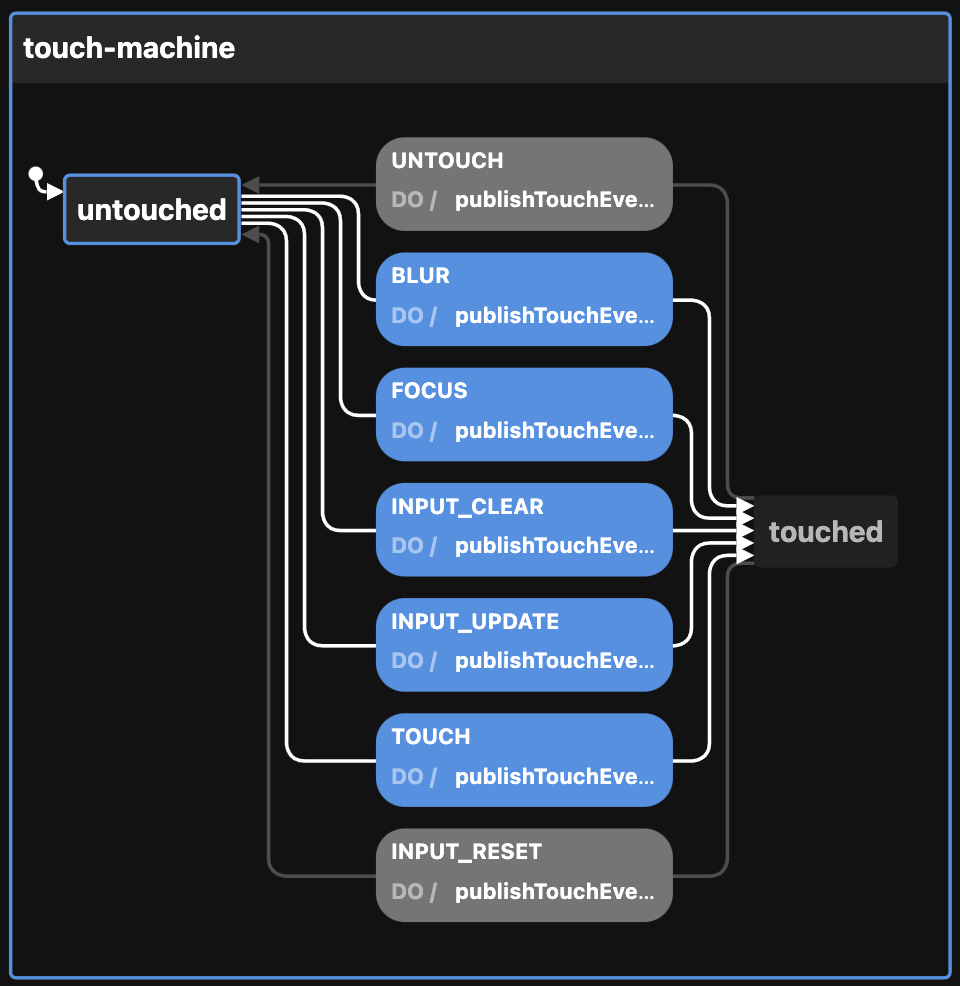

# Creating the Touch state machine

View the [Visualization](https://stately.ai/viz/3667f380-f1ea-4c11-aa55-443482f1a82e). See the `index.test.tsx` file for examples of use.

Calling `createTouchMachineConfig` thus:

```ts
createTouchMachineConfig({
  enabledEvents: [
    "BLUR",
    "FOCUS",
    "INPUT_CLEAR",
    "INPUT_RESET",
    "INPUT_UPDATE",
    "TOUCH",
    "UNTOUCH",
  ],                         // will publish to event bus on these transitions
  id: "touch-machine",       // defaults to generateShortId; should be unique
  initial: "touched",        // defaults to "untouched"
  otherOption: "whatever",   // any other key-value pairs are simply passed to the context
  topic: "topicName",        // used by the publishTouchEvent action
})
```

Returns this:

```ts
{
  machine: {
    context: {
      enabledEvents: [
        "BLUR",
        "FOCUS",
        "INPUT_CLEAR",
        "INPUT_RESET",
        "INPUT_UPDATE",
        "TOUCH",
        "UNTOUCH",
      ],
      otherOption: "whatever",
      topic: "topicName",
    },
    id: "touch-machine",
    initial: "touched",
    states: {
      untouched: {
        on: {
          BLUR: {
            actions: ["publishTouchEvent"],
            target: "touched",
          },
          FOCUS: {
            actions: ["publishTouchEvent"],
            target: "touched",
          },
          INPUT_CLEAR: {
            actions: ["publishTouchEvent"],
            target: "touched",
          },
          INPUT_UPDATE: {
            actions: ["publishTouchEvent"],
            target: "touched",
          },
          TOUCH: {
            actions: ["publishTouchEvent"],
            target: "touched",
          },
        },
      },
      touched: {
        on: {
          INPUT_RESET: {
            actions: ["publishTouchEvent"],
            target: "untouched",
          },
          UNTOUCH: {
            actions: ["publishTouchEvent"],
            target: "untouched",
          },
        },
      },
    },
  },
  actions: {
    publishTouchEvent: (context, event) => {
      const { enabledEvents = [], topic, ...rest } = context

      if (enabledEvents.includes(event.type)) {
        publish(
          {
            // No matter the transition, eventName is either TOUCH or UNTOUCH
            eventName: ["UNTOUCH", "INPUT_RESET"].includes(event.type) ? "UNTOUCH" : "TOUCH",
            data: { ...rest },
          },
          { topic: topic as string },
        )
      }
    },
  },
}
```

The optional `enabledEvents` determines which transitions will publish events to the Event Bus. Possible transitions include:

- BLUR (from FocusMachine)
- FOCUS (from FocusMachine)
- INPUT_CLEAR (from InputMachine)
- INPUT_RESET (from InputMachine)
- INPUT_UPDATE (from InputMachine)
- TOUCH
- UNTOUCH

The above be passed to XState's `createMachine` function by separating the machine from the actions:

```ts
const { machine, actions } = createTouchMachineConfig()

const touchStateMachine = createMachine(machine, { actions })
```

But see `useMachines` for how this is meant to be used with React and a configuration object.

Here is the machine as seen by the visualizer:


